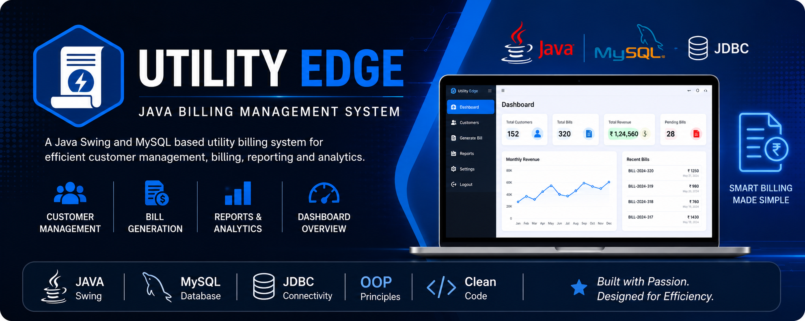
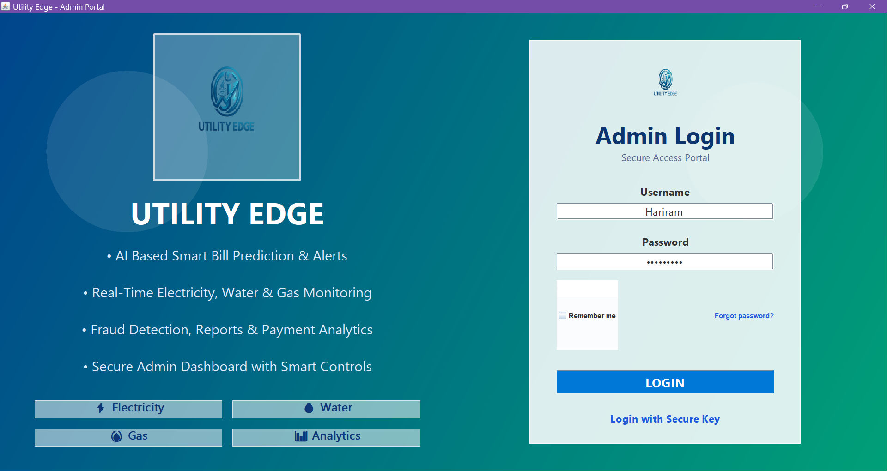
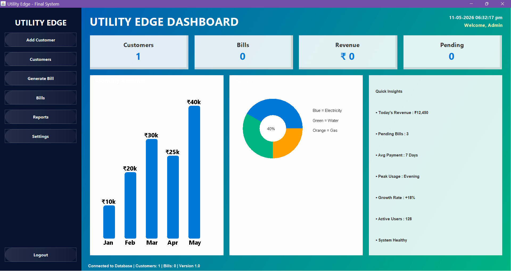
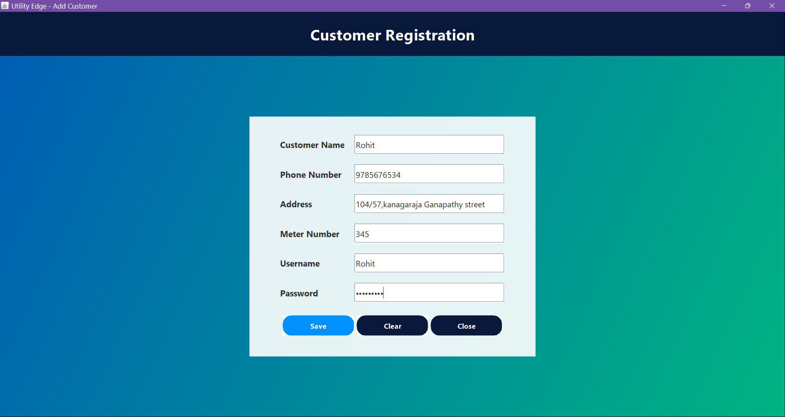
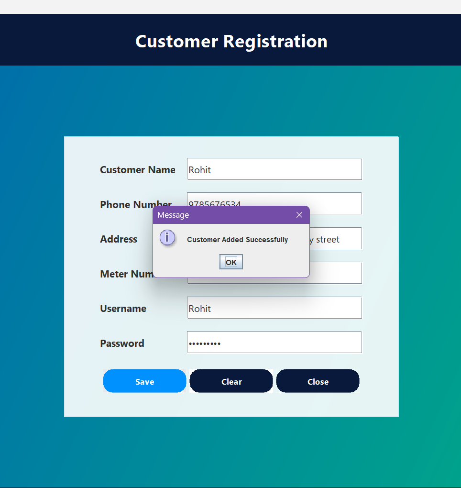
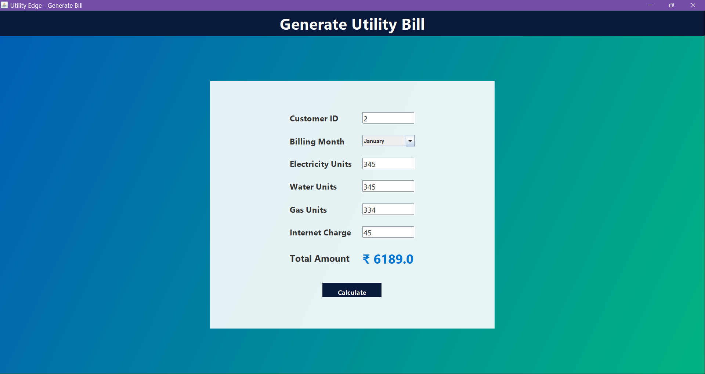
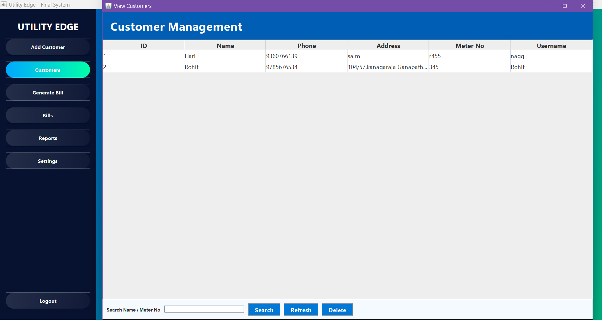
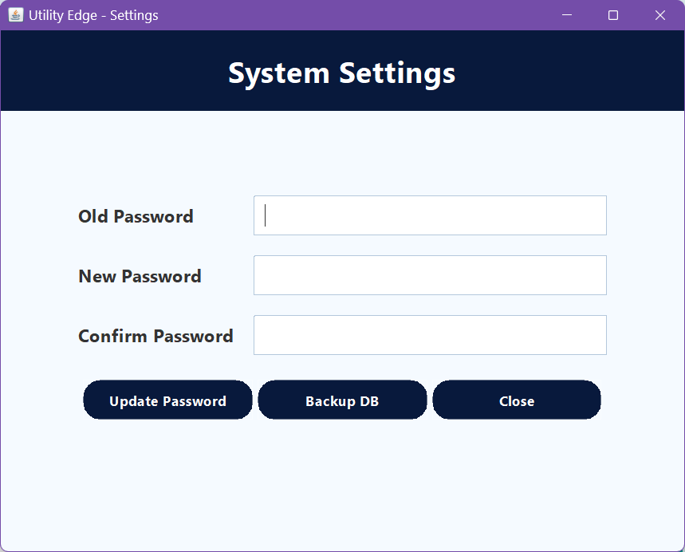

<p align="center">
  
</p>

# ⚡ Utility Edge – Java Billing Management System

A desktop-based Utility Billing Management System developed using **Java Swing**, **JDBC**, and **MySQL**. The application helps manage customers, generate utility bills, view reports, and maintain billing records through an easy-to-use graphical interface.

## 🚀 Features

- 🔐 Secure Admin Login
- 👥 Customer Management
- 📝 Bill Generation
- 📊 Dashboard
- 📋 Reports
- ⚙️ Settings
- 💾 MySQL Database Integration
- 🔄 CRUD Operations

## 🛠️ Technologies Used

- Java
- Java Swing
- JDBC
- MySQL
- SQL

## 📂 Project Structure

```
Utility-Edge-Java-Billing-System
│
├── src/
├── lib/
├── images/
├── utility_edge.sql
├── README.md
└── .gitignore
```

## ⚙️ Installation

1. Clone this repository:
   ```bash
   git clone https://github.com/Hariramkv/Utility-Edge-Java-Billing-System.git
   ```

2. Import the `utility_edge.sql` database into MySQL.

3. Add the MySQL Connector JAR from the `lib` folder.

4. Run `Main.java`.

## 📸 Screenshots

### 🔐 Login Screen



---

### 📊 Dashboard



---

### 👥 Add Customer



---

### ✅ Customer Added Successfully



---

### 📝 Generate Bill



---

### 📈 Reports



---

### ⚙️ Settings



## 🔮 Future Enhancements

- PDF Bill Generation
- Email Notifications
- Export Reports to Excel
- Dark Mode
- Cloud Database Support

## 👨‍💻 Author

**Hariram K V**

GitHub: https://github.com/Hariramkv